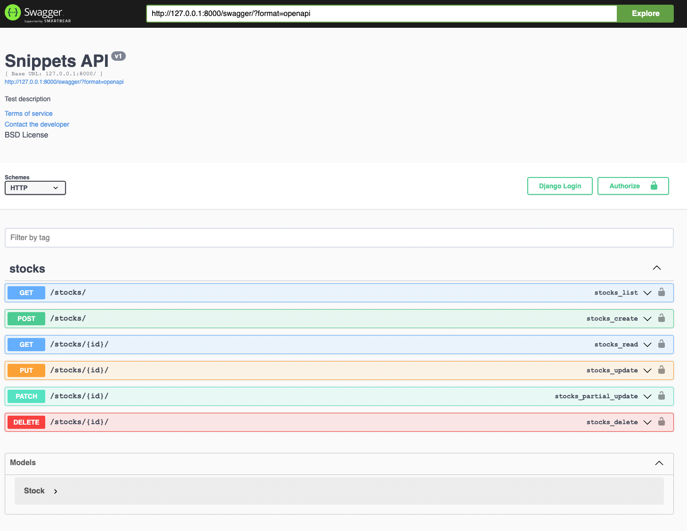

# Методические указания по выполнению лабораторной работы №6

## План

1. Добавление развертывания приложения React в GitHub Pages
2. Добавление компонентов для фильтрации в react
3. Доработка веб-сервиса для реализации фильтрации 
4. POST запросы. CORS
5. POST запросы. Axios
6. Добавление Swagger


## 1. Добавление фильтрации. Доработка фронтенда

Вернемся к нашему примеру с iTunes.

Здесь мы получаем список наших аудиозаписей в обработчике `handleSearch` с учетом введенного значения в `InputField`. Для обращения к нашему сервису в функцию `getMusicByName` передаем `searchValue` и используем его в AJAX запросе `fetch`

```jsx
import React, {useState} from 'react';
import { Col, Row, Spinner} from "react-bootstrap";
import MusicCard from "../../components/MusicCard";
import InputField from "../../components/InputField";
import { getMusicByName } from '../../modules'
import './ITunesPage.css';

const getMusicByName = async (name = DEFAULT_SEARCH_VALUE) =>{
    const res = await fetch(`https://itunes.apple.com/search?term=${name}`)
        .then((response) => {
            return response.json();
        }).catch(()=>{
            return {resultCount:0, results:[]}
        })
    return res
}

function ITunesPage() {

    const [searchValue, setSearchValue] = useState('radiohead');

    const [loading, setLoading] = useState(false)

    const [music, setMusic] = useState([])

    const handleSearch = async () => {
        await setLoading(true);
        const { results } = await getMusicByName(searchValue);
        await setMusic(results.filter(item => item.wrapperType === "track"));
        await setLoading(false)
    }

    return (
        <div className={`container ${loading && 'containerLoading'}`}>
            {loading && <div className="loadingBg"><Spinner animation="border"/></div>}
            <InputField value={searchValue} setValue={setSearchValue} loading={loading} onSubmit={handleSearch} buttonTitle="Искать"/>
            {!music.length ? <h1>К сожалению, пока ничего не найдено :(</h1>:
                <Row xs={4} md={4} className="g-4">
                {music.map((item, index)=>{
                    return(
                        <Col key={index}>
                            <MusicCard {...item}/>
                        </Col>
                    )
                })}
            </Row>
            }
    </div>
    );
}

export default ITunesPage;
```

```jsx
import {Button} from "react-bootstrap";
import React from "react";
import './InputField.css';

const InputField = ({ value, setValue, onSubmit, loading, placeholder, buttonTitle = 'Поиск'}) => {
    return <div className="inputField">
        <input value={value} placeholder={placeholder} onChange={(event => setValue(event.target.value))}/>
        <Button disabled={loading} onClick={onSubmit}>{buttonTitle}</Button>
    </div>
}

export default InputField
```

```jsx
import {Button, Card} from "react-bootstrap";
import React from "react";
import './MusicCard.css';

const MusicCard = ({artworkUrl100, artistName, collectionCensoredName, trackViewUrl}) => {

    return <Card className="card">
        <Card.Img className="cardImage" variant="top" src={artworkUrl100} height={100} width={100}  />
        <Card.Body>
            <div className="textStyle">
                <Card.Title>{artistName}</Card.Title>
            </div>
            <div  className="textStyle">
                <Card.Text>
                    {collectionCensoredName}
                </Card.Text>
            </div>
            <Button className="cardButton" href={trackViewUrl} target="_blank" variant="primary">Открыть в ITunes</Button>
        </Card.Body>
    </Card>
}

export default MusicCard;
```

## 2. Добавление фильтрации. Доработка веб-сервиса
Методы нашего сервиса на бэкенде должны предусматривать получение значений всех фильтров в качестве входных параметров

#### filter()

`filter(*args, **kwargs)`

Возвращает новый `QuerySet`, содержащий объекты, которые соответствуют заданным параметрам поиска.

Параметры поиска (`**kwargs`) должны быть в формате, описанном в Полевые поиски ниже. Несколько параметров объединяются через "И" в базовом операторе `SQL`.

Если вам необходимо выполнить более сложные запросы (например, запросы с операторами OR), вы можете использовать `Q objects (*args)`.

#### order_by()

`order_by(*fields)`

По умолчанию результаты, возвращаемые QuerySet, упорядочиваются с помощью кортежа, заданного параметром ordering в классе Meta модели. Вы можете переопределить это для каждого QuerySet, используя метод order_by.

Пример:

```python
Entry.objects.filter(pub_date__year=2005).order_by('-pub_date', 'headline')
```

Приведенный выше результат будет упорядочен по убыванию `pub_date`, затем по возрастанию `headline`.

## 3. POST запросы. CORS

Вы уже столкнулись с CORS политиками ранее при выполнении GET запроса к вашему сервису. Но расширение браузера не лучшее решение данной проблемы. Поэтому рассмотрим проксирование запросов к бэкенду на фронтенде. 

Схема проксирования такая: фронт -> прокси -> бек. Так как фронт будет отправлять запросы на свою локальную проксю (/*), то ошибки не будет

[Пример проксирования](https://medium.com/bb-tutorials-and-thoughts/react-how-to-proxy-to-backend-server-5588a9e0347)

## 4. POST запросы. Axios

Для выполнения данной лабораторной работы вам понадобятся POST запросы для внесения новых данных о ваших покупках, а также запросы для удаления записей при обращении к вашему сервису

Выполнение POST-запроса

```js
axios.post('/user', {
        firstName: 'Fred',
        lastName: 'Flintstone'
    })
    .then(function (response) {
        console.log(response);
    })
    .catch(function (error) {
        console.log(error);
    });
```


## 5. Добавление Swagger

Подключение swagger к Django Rest Framework делается очень просто. Для начала необходимо скачать зависимость:

`pip install -U drf-yasg`

Далее в файле *settings.py* подлючаем:

```python
INSTALLED_APPS = [
   ...
   'django.contrib.staticfiles',  #Необходим для  swagger ui's css/js файлов (По умолчанию включен)
   'drf_yasg',
   ...
]
```

Затем в файле *urls.py*:

```python
from rest_framework import permissions
from django.urls import path, include
from drf_yasg.views import get_schema_view
from drf_yasg import openapi

...

schema_view = get_schema_view(
   openapi.Info(
      title="Snippets API",
      default_version='v1',
      description="Test description",
      terms_of_service="https://www.google.com/policies/terms/",
      contact=openapi.Contact(email="contact@snippets.local"),
      license=openapi.License(name="BSD License"),
   ),
   public=True,
   permission_classes=(permissions.AllowAny,),
)

urlpatterns = [
    ...
    path('swagger/', schema_view.with_ui('swagger', cache_timeout=0), name='schema-swagger-ui'),
   ...
]
```

Запускаем приложение и переходим по адресу: *http://127.0.0.1/swagger/* и видим:



Далее при добавлении новый обработчиков, `drf_yasg` будет автоматически добавлять их в swagger. Также сгенерируется файл в формате json из которого мы сможешь при надобности сгенерировать типы данных на фронтенде. Этот файл доступен по ссылке http://127.0.0.1:8000/swagger/?format=openapi


Для этого нам необходимо скачать библиотеку `swagger-typescript-api`:

`npm i --save-dev swagger-typescript-api`

Далее добавить в `package.json` команду:

```json
{
    "scripts": {
        "generate-backend-types": "swagger-typescript-api -p http://127.0.0.1:8000/swagger/?format=openapi --no-client -o ./types/autogenerated -n backend.ts"
    }
}
```

Выполним `npm run generate-backend-types` и получим в папке `types/autogenerated` файл `backend.ts` внутри которого будут сгенерированы интерфейсы повторяющие сущности из бэкенда.
