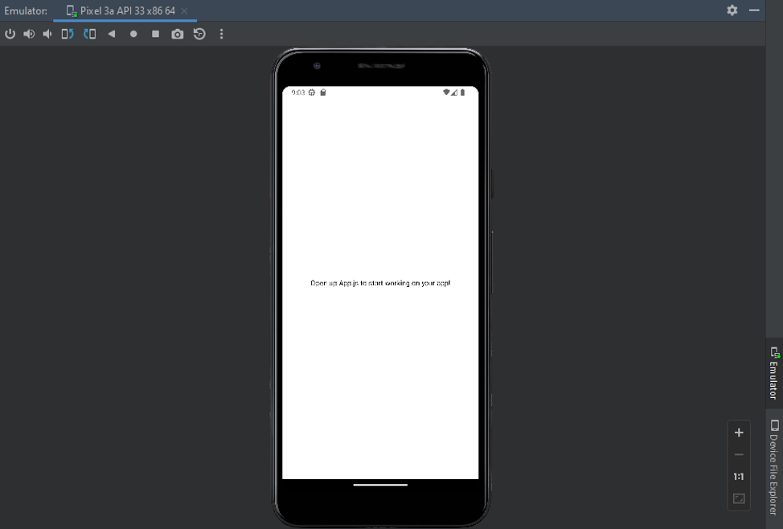
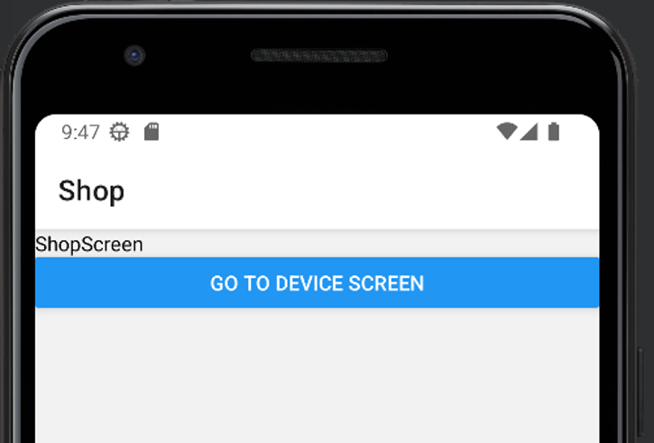

# React Native

Создаем проект командой

`npx create-expo-app`

Запускаем проект командой

`npm start`

Проект запущен, теперь надо где-нибудь его открыть. Можно установить на телефон приложение Expo Go (android) или просто открыть камеру и отсканировать `QR` на `iOS` и смотреть все изменения на телефоне, либо установить `Android Studio` и смотреть на все изменения там.

`developer.android.com/studio`

После установки у меня автоматически создался телефон. Открываем созданный проект в `Android Studio`. Справа нажимаем на `Device Manager`, и запускаем телефон. Ждем, пока он настроится, после видим это

Возвращаемся туда, где был запущен проект, либо можно остаться работать в `Android Studio`.

Нажимаем `a`, чтобы открыть проект на андроиде.

Проект будет запускаться долго, когда запустится, мы увидим наш `hello world` на `RN`.

Но так делать что-то неудобно, поэтому ПКМ по названию телефона, `View Mode` и выбираем Window. Уже удобнее

Для начала настроим роутинг в нашем приложении.

`npm install @react-navigation/native @react-navigation/native-stack`

`expo install react-native-screens react-native-safe-area-context`

Позднее может появиться ошибка, что `react-native-safe-area-context` есть как зависимость, но не установлена, тогда нужно просто написать `npm i`

Создаем папку `screens`, в ней создадим две страницы – главную страницу магазина и страницу товара

А также изменим `App.js`

Теперь с главной страницы по кнопке мы можем перейти на страницу телефона

Теперь займемся хранилищем, а после визуализируем все данные

`npm i react-redux @reduxjs/toolkit axios`

создаем в папке `store` файл `index.js`

Оборачиваем наше приложение в `Provider`

Теперь в папке `store` создаем наш слайс

У меня в функции `setDevices` написано `state.devices = payload.rows`, у вас будет просто `state.devices = payload`

Если не уверены в том, что данные приходят так, как вы думаете, всегда можно написать `console.log(payload)` внутри редьюсера и убедиться

И добавляем его в `store`

Создаем папку `API` и в ней `index.js`

!!! обязательно `url` в таком виде, не `localhost`, иначе запросы будут падать

Создаем в папке components файл `DeviceCard.jsx`

После этого на странице с помощью `useEffect` отправляем запрос и через `dispatch` записываем данные в хранилище

И после сохранения видим в консоли заветное:

Теперь наведем немного красоты и сделаем нормальную карточку товара, в моем случае телефона

И посмотрим, что мы передали вместе с нажатием параметр – `id` товара (функция `handlePress`)

И перейдя на страницу, мы увидим наш переданный параметр

Теперь займемся вторым запросом на получение данных о конкретном товаре

В терминале видим лог о том, что данные записались в хранилище

А на странице теперь видим информацию о названии товара

Теперь вам осталось только вывести всю информацию о товаре, аналогично компоненту `DeviceCard`.

Если у вас всё работало, ответы с сервера приходили, но через время запросы начали падать, обновите `URL` бэкенда
